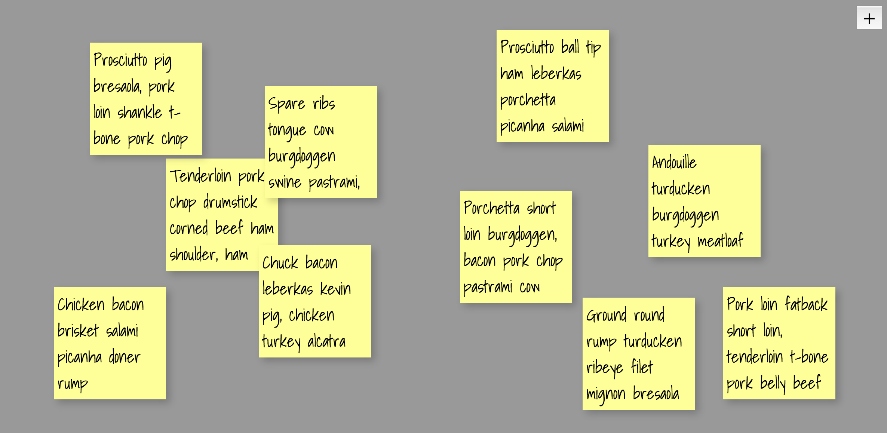

# sticky-notes
React JS App where users can create and organize sticky notes.

## Technologies Used
* [React JS](https://facebook.github.io/react/)
* [React DOM](https://facebook.github.io/react/docs/react-dom.html)
* [React Draggable](https://github.com/mzabriskie/react-draggable)
* [Bacon Ipsum API](http://baconipsum.com)

## To Do
* Build an API with Express and Node that runs with the application
